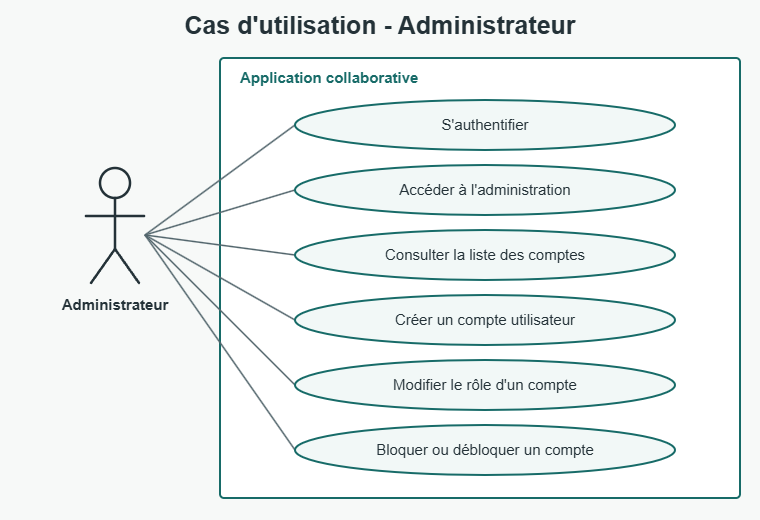
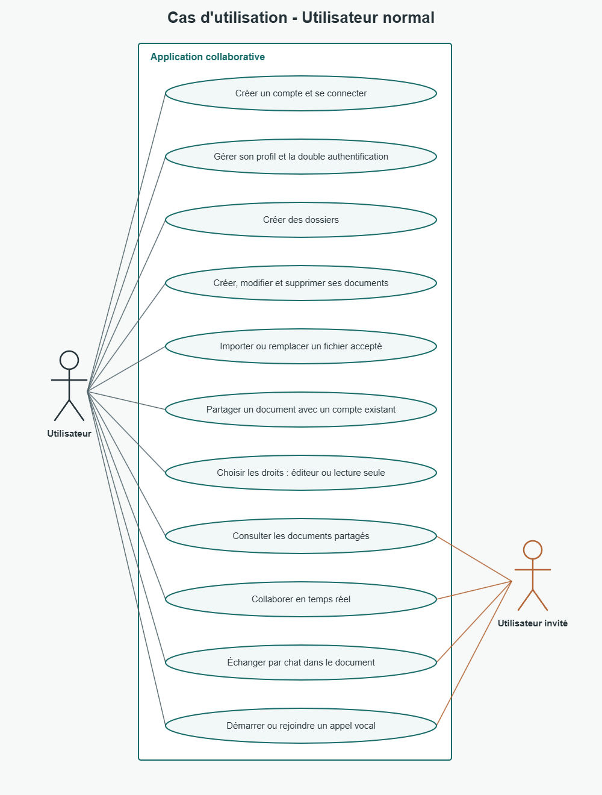

## Compte rendu du projet

## Présentation

Le projet est une application web collaborative qui permet de créer, organiser et partager des documents. Les utilisateurs peuvent travailler ensemble sur un document, échanger par chat et participer à un appel vocal. Un espace d'administration permet de gérer les comptes et leurs accès.

## Répartition des tâches

Yvanne Rosat: partie temps réel (WebSocket). Appel vocal (WebRTC) et chat.

Mountasir: partie back. Connexion (authentification), double authentification (2FA par TOTP), gestion partie admin.

Victor: édition du document en temps réel. Il s'est appuyé sur le socket mis en place par Yvanne pour synchroniser le contenu en pair à pair entre deux utilisateurs connectés sur un même document.

## Choix des composants

- Interface web : React structure l'application en pages et composants réutilisables. Vite fournit l'environnement de développement et la construction du frontend.

- Navigation et état : React Router gère les pages. Le contexte d'authentification et les hooks dédiés centralisent les informations de session, les documents et les dossiers.

- API : Node.js et Express exposent une API REST pour l'authentification, les profils, les documents, les dossiers et l'administration. Cette API porte aussi les règles d'accès.

- Base de données : MySQL conserve les comptes, les rôles, les documents, leurs fichiers et les permissions de partage. Une base relationnelle convient aux liens entre utilisateurs, documents et membres.

- Temps réel : Socket.IO, sur un serveur distinct, gère la présence, la diffusion des modifications, le chat et la signalisation nécessaire aux appels. La séparation de l'API isole les requêtes classiques des échanges persistants.

- Appels vocaux : WebRTC permet l'échange audio directement entre navigateurs. Un serveur STUN aide les navigateurs à établir cette connexion à travers les réseaux usuels.

- Sécurité : Les mots de passe sont hachés avec bcrypt. La session utilise un jeton JWT placé dans un cookie httpOnly. La double authentification TOTP est proposée en option depuis le profil.

- Exécution : Docker Compose orchestre MySQL, l'API, le serveur temps réel et le frontend pour simplifier le démarrage de l'ensemble.

## Fonctionnalités réalisées

- Création de compte, connexion et déconnexion, avec contrôle des comptes bloqués.

- Consultation et modification du profil ; activation ou désactivation facultative de la double authentification.

- Création de documents texte, modification et suppression par leur propriétaire, avec sauvegarde du contenu.

- Création de dossiers pour organiser les documents.

- Import, remplacement et consultation de fichiers PDF et d'images PNG, JPEG, GIF ou WebP, dans la limite de 20 Mo par fichier.

- Partage d'un document avec un compte existant, au choix en lecture seule (viewer) ou avec droit de modification (editor).

- Collaboration sur un document : présence des personnes en ligne, mise à jour du texte en temps réel, chat associé au document et appel vocal.

- Administration des comptes : consultation, création, changement de rôle, blocage et déblocage.

## Cas d'utilisation : administrer les comptes

## Cas d'utilisation : créer et partager un document

