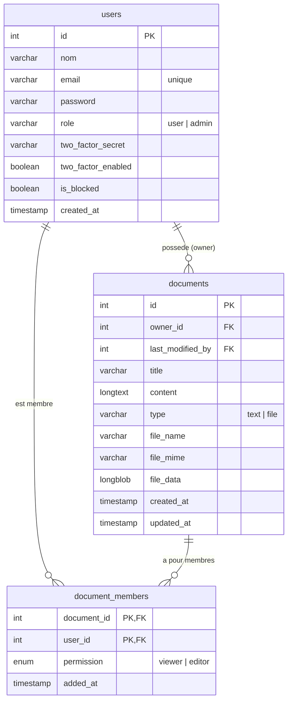

# Document explicatif

## Le projet

Application web collaborative de construction de documents en temps réel, sur le modèle d'un wiki. Plusieurs personnes travaillent ensemble sur un même document texte, avec une messagerie instantanée et un appel audio intégrés. L'authentification protège l'accès, et un rôle administrateur gère les comptes.

## Répartition des tâches

Équipe de trois. La base de données a été réfléchie et conçue ensemble.

- **Yvanne Rosat** : partie temps réel (WebSocket). Appel vocal (WebRTC) et chat.
- **Mountasir** : partie back. Connexion (authentification), double authentification (2FA par TOTP), routes CRUD des documents.
- **Victor** : édition du document en temps réel. Il s'est appuyé sur le socket mis en place par Yvanne pour synchroniser le contenu en pair à pair entre deux utilisateurs connectés sur un même document.

## Choix techniques

| Technologie | Rôle | Pourquoi |
|---|---|---|
| React + Vite | Interface | Rapide à développer, rechargement instantané. |
| Express + MySQL | API REST | Serveur JavaScript simple, base relationnelle adaptée aux comptes et aux documents. |
| Socket.IO | Temps réel | Présence, chat et signalisation via WebSocket, avec repli automatique. |
| WebRTC + STUN | Audio | Flux audio direct entre navigateurs, sans serveur média. |
| JWT (cookie httpOnly) + TOTP | Auth et 2FA | Session sûre côté serveur, second facteur standard compatible avec les applications d'authentification. |
| Docker Compose | Orchestration | Lancer base, API, temps réel et front d'une seule commande. |

Contrainte du sujet respectée : serveur en JavaScript, application entièrement faite maison, aucune solution existante réutilisée.

## Choix architectural

L'application est divisée en **deux serveurs** : une API REST pour les requêtes classiques (authentification, documents, administration) et un serveur temps réel pour le collaboratif (présence, chat, signalisation). Séparer ces deux responsabilités garde chaque serveur simple et permet de les faire évoluer indépendamment.

## Base de données

Un utilisateur possède plusieurs documents. Un document réunit plusieurs membres via `document_members`, qui porte le niveau de permission (viewer ou editor). Un même utilisateur peut être membre de plusieurs documents.
