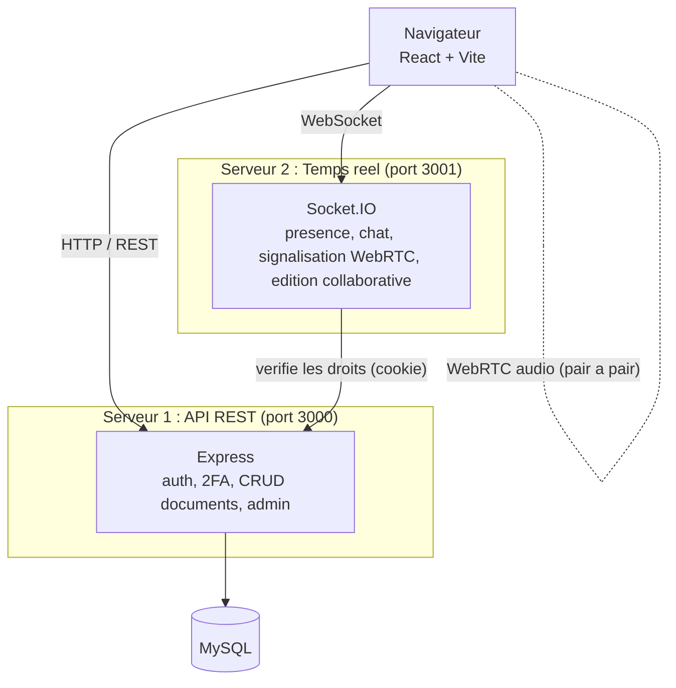
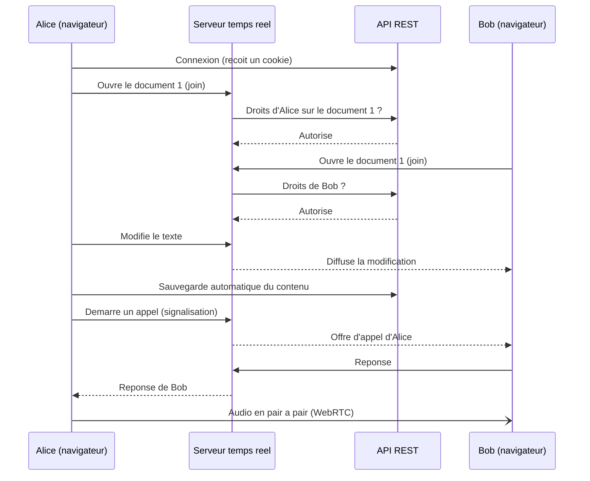
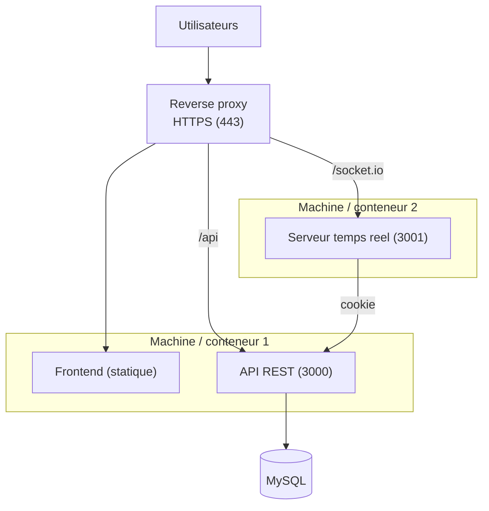

# Architecture et hébergement

## Vue d'ensemble

L'application repose sur **deux serveurs** distincts :

- **Serveur 1, API REST** : requêtes classiques (authentification, 2FA, CRUD des documents, administration).
- **Serveur 2, temps réel** : collaboratif (présence par document, chat par document, signalisation WebRTC, édition en temps réel).

Cette séparation isole deux charges très différentes : des requêtes ponctuelles d'un côté, des connexions longues et nombreuses de l'autre. Chaque serveur reste simple et peut être dimensionné ou redéployé sans toucher à l'autre.

## Schéma d'architecture

Point clé : le serveur temps réel ne connaît pas les mots de passe. Pour autoriser un utilisateur sur un document, il rappelle l'API REST en lui transmettant le **cookie d'authentification** du client. L'API répond si l'accès est valide. La sécurité reste centralisée côté API.

## Moyens de communication

| Canal | Entre | Usage | Justification |
|---|---|---|---|
| HTTP / REST | Navigateur et API | Connexion, comptes, documents | Simple, sans état, adapté aux requêtes ponctuelles. |
| WebSocket (Socket.IO) | Navigateur et serveur temps réel | Présence, chat, signalisation, édition | Bidirectionnel et persistant, idéal pour le temps réel. |
| WebRTC (pair à pair) | Navigateur et navigateur | Flux audio de l'appel | L'audio circule en direct, sans transiter par nos serveurs. |
| Appel interne | Serveur temps réel vers API | Vérification des droits | Réutilise l'authentification déjà en place, pas de logique dupliquée. |

Pour l'audio, un serveur **STUN** (public) permet aux deux navigateurs de se découvrir derrière la plupart des box et pare-feu. Sur des réseaux très restrictifs (NAT symétrique, certaines entreprises), un serveur **TURN** (relais) serait nécessaire pour faire transiter le flux. Le chat et l'édition, eux, passent toujours par le serveur temps réel et fonctionnent partout.

## Scénario : deux utilisateurs éditent et s'appellent

L'édition est relayée en temps réel par le serveur temps réel et sauvegardée en base via l'API. La signalisation de l'appel passe aussi par le serveur temps réel, mais une fois la connexion établie, l'audio circule directement entre les deux navigateurs.

## Hébergement

Proposition de déploiement en production :

- Un **reverse proxy** en façade termine le HTTPS et route les requêtes : le frontend, `/api` vers l'API REST, `/socket.io` vers le serveur temps réel. Une seule origine publique, donc pas de problème de CORS ni de cookies entre domaines.
- Les **deux serveurs** (API et temps réel) tournent en conteneurs, sur une ou deux machines selon la charge. Le serveur temps réel étant le plus sollicité, il peut être isolé.
- La base **MySQL** est jointe uniquement par l'API. Elle n'est pas exposée publiquement.
- La configuration passe par des **variables d'environnement** (`.env`) : identifiants MySQL, secret JWT, origine autorisée. Aucun secret dans le code.

En développement, **Docker Compose** orchestre les quatre services d'une seule commande : `mysql`, `api`, `realtime`, `frontend`. La même image sert de base au déploiement, ce qui garde l'environnement identique du poste de dev à la production.
